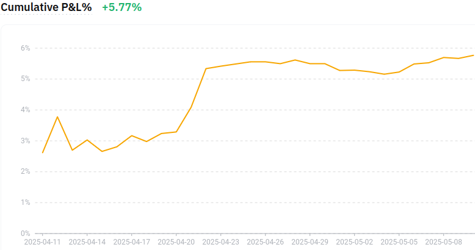

# Volatility Harvesting (Floating Percent)




A multi-exchange spot trading bot implementing volatility harvesting strategy with dynamic portfolio rebalancing.

## Supported Exchanges

- ✅ **ByBit** - Fully implemented (`vh_float.py`, `api/bybit.py`)
- 🔜 **Binance** - Coming soon (placeholder ready in `api/binance.py`)
- 🔜 **Crypto.com** - Coming soon (placeholder ready in `api/cryptocom.py`)

The bot uses a **modular architecture** via FastAPI with separate routers for each exchange, making it easy to add new exchanges. Each exchange maintains its own isolated data directory.

## Project Structure

```
volatility_harvesting/
├── api_main.py              # Main FastAPI application entry point
├── run_app.py               # Application runner script
├── vh_float.py              # ByBit spot trader implementation
├── api/                     # Modular API structure
│   ├── __init__.py          # Export all routers
│   ├── models.py            # Pydantic models for requests/responses
│   ├── auth.py              # OAuth2 authentication (Bearer token)
│   ├── dependencies.py      # Shared state and utilities
│   ├── config.py            # Configuration management
│   ├── bybit.py             # ByBit exchange routes
│   ├── binance.py           # Binance routes (placeholder)
│   ├── cryptocom.py         # Crypto.com routes (placeholder)
│   └── README.md            # API module documentation
├── tests/                   # Test suite (pytest)
│   ├── conftest.py          # Shared fixtures (client, auth headers)
│   ├── STATUS.md            # Test status and documentation
│   ├── api/                 # API endpoint tests
│   │   ├── test_main.py     # Main endpoints (/, /exchanges)
│   │   └── routes/          # Exchange-specific route tests
│   │       ├── test_login.py   # Authentication tests
│   │       └── test_bybit.py   # ByBit endpoint tests
│   └── utils/               # Test utilities
│       ├── utils.py         # Helper functions (random_email, get_token)
│       └── trader.py        # Mock data generators
├── data/                    # Production data (auto-created)
│   ├── bybit/               # ByBit: trading.log, BTCUSDC.json, data_s1.dat
│   ├── binance/             # Binance data directory
│   └── cryptocom/           # Crypto.com data directory
├── .github/                 # GitHub Actions workflows
│   └── workflows/
│       └── tests.yml        # Automated testing on push/PR
├── api_config.json          # API state persistence (auto-generated)
├── pyproject.toml           # Project configuration (uv)
├── requirements.txt         # Python dependencies
├── pytest.ini               # Pytest configuration
├── .env                     # Configuration (copy from .env_example)
└── docker-compose.yaml      # Docker configuration
```

See [api/README.md](api/README.md) for detailed API documentation.

## Installation

```bash
pip install -r requirements.txt
```

## Configuration

1. Copy the example environment file:
   ```bash
   cp .env_example .env
   ```

2. Edit `.env` file and configure the following parameters:

   **Trading Configuration:**
   - `API_KEY` - Your Bybit API Key ([Get it here](https://www.bybit.com/app/user/api-management))
   - `SECRET_KEY` - Your Bybit API Secret
   - `STABLE_PAIR` - Stablecoin to use (default: USDT)
   - `MA_LENGTH` - Moving Average period for trading signals (default: 24 minutes)
   - `RANGE` - Price range for portfolio ratio calculation (default: 50000 pips)
   - `MIN_RATIO` - Minimum crypto allocation (default: 0.01 = 1%)
   - `MAX_RATIO` - Maximum crypto allocation (default: 0.99 = 99%)
   - `REBALANCE_TOP` - Sell trigger percentage (default: 3.0%)
   - `REBALANCE_BOTTOM` - Buy trigger percentage (default: 3.0%)
   - `REBALANCE_ISDYNAMIC` - Enable Fibonacci scaling (default: true)
   - `AMPLITUDE_TIME_FRAME` - Time window for amplitude calculation (in minutes)
   - `FEE` - Trading fee percentage (default: 0.1%)
   - `TGBOT_TOKEN` - Telegram bot token for notifications (optional)
   - `TGBOT_CHATID` - Telegram chat ID for notifications (optional)

   **API Authentication (OAuth2):**
   - `ADMIN_USERNAME` - API admin username (default: admin)
   - `ADMIN_PASSWORD` - API admin password (**change this!**)
   - `JWT_SECRET_KEY` - JWT secret key for token signing (**generate a strong random key!**)

3. Ensure you have sufficient balance in your Bybit spot account

## Running the Bot

### Method 1: Using FastAPI (Recommended - Multi-Exchange Support)

Start the API server:

```bash
python api_main.py
```

Or with uvicorn:

```bash
uvicorn api_main:app --host 0.0.0.0 --port 8000
```

The API features:
- ✅ **OAuth2 Authentication**: Secure Bearer token authentication
- ✅ **Auto-start**: Bots with `is_started=true` restart automatically after server restart
- ✅ **State persistence**: Configuration saved to `api_config.json` on every change (this file is autogenerated)
- ✅ **Isolated data**: Each exchange stores data in `data/<exchange_name>/` directory
- ✅ **Modular routes**: Separate router files for each exchange in `api/` folder
- ✅ **Response samples**: Complete request/response examples in documentation
- ✅ **CORS enabled**: Unrestricted CORS for development (⚠️ restrict in production)


#### Web Interface

Access interactive documentation:
- **API Docs (Swagger UI)**: http://localhost:8000/docs
  - Click "Authorize" button and enter your credentials
  - Test all endpoints interactively
- **Alternative Docs (ReDoc)**: http://localhost:8000/redoc

See [api/README.md](api/README.md) for complete API documentation.

### Method 2: Using Python directly (ByBit only):

```bash
python vh_float.py
```

### Method 3: Using Docker:

Build and run the container in detached mode:

```bash
docker compose build
docker compose up -d
```

View logs:

```bash
docker compose logs -f
```

Stop the bot:

```bash
docker compose down
```

## Monitoring

- **Console output**: Real-time trading activity
- **Log files**: `data/<exchange>/trading.log` - detailed trading history (auto-rotated at 10MB, keeps 5 backups)
- **State files**: `data/<exchange>/BTCUSDC.json` - current trading state
- **Telegram notifications**: Trade alerts (if configured in `.env`)
- **FastAPI endpoints**: Programmatic access to all trading data and controls (requires authentication)
  - `POST /token` - Get access token (no auth required)
  - `GET /bybit/status` - Bot status and running state
  - `GET /bybit/balance` - Real-time account balance
  - `GET /bybit/stats` - Trading statistics and analysis

## API Architecture

The project uses a **modular FastAPI architecture** for managing multiple exchanges:

### Key Features

- **🔐 OAuth2 Authentication**: Secure Bearer token authentication with JWT
- **📦 Modular Design**: Each exchange has its own router file (`api/bybit.py`, `api/binance.py`, etc.)
- **🎯 Pydantic Models**: Centralized request/response models in `api/models.py`
- **🔄 Shared Dependencies**: Common utilities in `api/dependencies.py` (traders dict, event loop management)
- **💾 Configuration Management**: Auto-save to `api_config.json` on every state change
- **📁 Data Isolation**: Each exchange stores data in `data/<exchange_name>/` directory
- **🚀 Auto-start**: Bots with `is_started=true` restart automatically after server restart
- **⚙️ Task Management**: Proper cancellation of main loop + all background tasks (WebSockets, etc.)
- **📚 Complete Documentation**: Request/response examples in Swagger UI and ReDoc
- **🌐 CORS Enabled**: Unrestricted CORS for development (⚠️ configure properly for production)

### Security Notes

⚠️ **Important for Production:**
- Change `ADMIN_PASSWORD` in `.env` to a strong password
- Generate a strong `JWT_SECRET_KEY` (use: `openssl rand -hex 32`)
- Restrict CORS origins in `api_main.py` (currently set to `["*"]`)
- Use HTTPS in production
- Consider rate limiting and additional security measures

### Adding a New Exchange

1. Create `api/exchange_name.py` with FastAPI router
2. Define response models in `api/models.py` or create exchange-specific models
3. Implement start/stop/status endpoints with authentication
4. Add router to `api/__init__.py`
5. Include router in `api_main.py`

See [api/README.md](api/README.md) for step-by-step guide with code examples.

--------------

## Strategy Overview

Volatility harvesting is actually not a complicated strategy, but it requires a re-evaluation of the way we view price movements in the market.

It is based on two conditions:
1. The probability of the price moving up or down over n time is always equal to a "coin toss," or 50/50.
    - We deliberately ignore all other conditions, considering them external (such as political events, news, etc.)
    - The market volume of BTC and the number of participants is so huge that any external influence will inevitably be balanced out.
2. Extreme price fluctuations (for example $60k, $16k, $100k) occur within a reasonable time frame.
    - This means periods of decline and rise do not last for decades.

Bitcoin fits these conditions well. Next, let's look at the strategies included in Volatility harvesting.
### HODL
What if we bought BTC with $1 for every price point from $10k to $60k as it rises?
We would pay $50,000 at an average price of $35k and would be in good profit. This is a standard HODL strategy.
As the price drops to $16k, the portfolio will suffer losses.
### DCA
What if we make a small adjustment to HODL and sell each purchased BTC ($1) if its price increases by a certain percent?
This would be a standard DCA (Dollar Cost Averaging) strategy.
### VA
Now, let's try buying more than BTC ($1) and selling less than BTC ($1) as the price decreases, and vice versa — buying less and selling more as the price increases. This will be similar to the DVA or VA strategy.

It should be noted that DCA and DVA are considered investment strategies. Simply put, it is a way to enter the market by accumulating BTC in the portfolio at specific periods or price change ranges (for example, "by grid").
### Volatility harvesting
We just make sure the portfolio is always 50% / 50%.
We rebalance when the ratio in the portfolio changes. For example, if the asset price increases and the ratio becomes 60% / 40%, we sell the asset by 10%, thereby restoring the balance to 50% / 50%.

It's clear that with all these strategies, BTC is just sitting on the shelf, to use retail terminology.
Our goal is to sell everything we bought, with profit and as quickly and efficiently as possible, as in swing trading.
We will not consider strategies that rely on the "survivorship bias," such as trend-based ones.
But ideally, everything should work "by itself," without tedious technical analysis and news reading.
We need a universal formula that fully complies with mathematical probabilities.

 ### Portfolio balancing formula with zero risk:
```
if BTC price = $0.01 then portfolio balance ratio = 100% (BTC) / 0% (USDT)
if BTC price = ATH then portfolio balance ratio = 0% (BTC) / 100% (USDT)
```
If you want to take more risk for higher profits, you can limit the range by half:
```
if BTC price = ATH/2 $ then portfolio balance ratio = 100% (BTC) / 0% (USDT)
if BTC price = ATH then portfolio balance ratio = 0% (BTC) / 100% (USDT)
```

### Volatility harvesting with floating ratio
```
Initial portfolio state: BTC = 0.0, STABLE_PAIR = 1000.0 USD
TOTAL_AMOUNT = 1000 USD
BTC price = ATH (100000 USD)
RATIO = 0.0
RANGE = 100000

Value of each price pip:
    TOTAL_AMOUNT / RANGE = 0.01 USD
    If the price drops by 1000 pips, we buy 1000 * ~0.01 = 10 USD

RATIO_PER_PIP = 1.0 / RANGE = 0.00001
Each tick will change the portfolio ratio as RATIO +(-) RATIO_PER_PIP
Suppose the price dropped by 500 pips:
RATIO += 500 * 0.00001 = 0.005
Now the portfolio balance will be BTC = 0.5%, STABLE_PAIR = 99.5%
```
At ATH we have 0% / 100%, and as the price falls, the left percentage increases and the right decreases.

When to rebalance the portfolio:
- Sell BTC when the percent changes by at least 2% (if fee = 0.1)
- Sell or buy on price reversals, for example, when EMA24 and MA24 cross
- To avoid false reversals, check the local price range, e.g., for 2 hours


It is hard to imagine a formula more universal than this.
It seems that effective traders and large funds follow it in the vast majority of cases.
Even intraday traders on short ranges most likely intuitively adhere to this formula.

This is not financial advice. Use at your own risk.
